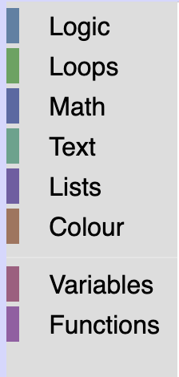
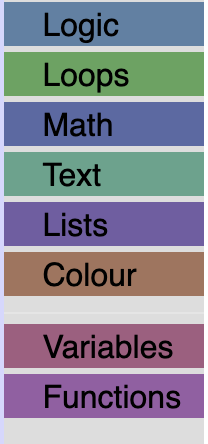
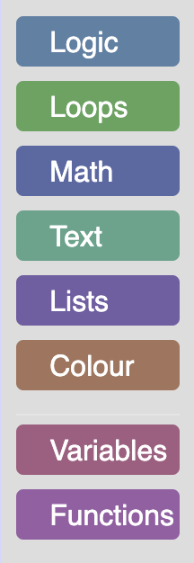
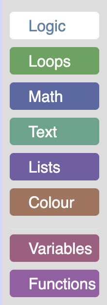
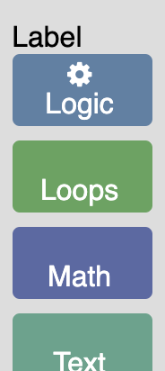

author: Abby Schmiedt
summary: Codelab to customize a toolbox
id: custom-toolbox
categories: blockly,codelab,toolbox,customization
status: Draft
Feedback Link: https://github.com/google/blockly-samples/issues/new

# Customizing a Blockly toolbox

## Codelab overview

### What you'll learn
This codelab will focus on customizing the Blockly toolbox.

In this codelab you will learn: 
1. How to add a background color to a toolbox category.
1. How to change the look of a selected category.
1. How to add a custom CSS classes to a toolbox category.
1. How to change the structure of your category HTML.
1. How to add a custom toolbox item.

### What you'll build

Over the course of this codelab you will customize your toolbox categories as well
create a custom toolbox item.
The resulting toolbox is shown below.


The code samples are written in ES6 syntax. You can find the code for the [completed custom toolbox](https://github.com/google/blockly-samples/tree/master/codelabs/custom_toolbox/final_src) on GitHub, in both ES5 and ES6 syntax.

### What you'll need

This codelab assumes that you are already comfortable using the Blockly
playground locally.  You can find it in `tests/playground.html`.
It also assumes you have a basic understanding of the
[Blockly toolbox](https://developers.google.com/blockly/guides/configure/web/toolbox).

Throughout various parts of this codelab we will be talking about [toolbox definitions](https://developers.google.com/blockly/guides/configure/web/toolbox#xml).
The toolbox definition can now be written in either XML or JSON. We will be using the
[default XML toolbox definition](https://github.com/google/blockly/blob/11987dc6d6aa16138b36237e8959f2a3f91eb4e2/tests/playground.html#L471) that can be found in `playground.html`.

## Setup

In this codelab you will customize a toolbox category and create a new toolbox item.
We will be using the Blockly playground to test out our changes as we go.
You can find the playground at `tests/playground.html`.

To start, create a file named `custom_category.js` in the same folder as
`playground.html`. Include your new file with a script tag:
```
<script src="custom_category.js"></script>
```

Note: you must include your custom code *after* including the Blockly library.

## Define and register a custom category

In order to create a custom category we will create a new category that extends 
the default `Blockly.ToolboxCategory` class. Add the following code to your
`custom_category.js` file.
```js
class CustomCategory extends Blockly.ToolboxCategory {
  /**
   * Constructor for a custom category.
   * @override
   */
  constructor(categoryDef, toolbox, opt_parent) {
    super(categoryDef, toolbox, opt_parent);
  }
}
```

After defining your category you need to tell Blockly that it exists.
Register your category by adding the below code to the end of `custom_category.js`.
```js
Blockly.registry.register(
    Blockly.registry.Type.TOOLBOX_ITEM,
    Blockly.ToolboxCategory.registrationName,
    CustomCategory, true);
```
By registering our `CustomCategory` with `Blockly.ToolboxCategory.registrationName`
we are overriding the default category in Blockly. Because we are overriding a
toolbox item instead of adding a new one, we must pass in `true` as the last
argument. If this flag is `false`, `Blockly.registry.register` will throw
an error because we are overriding an existing class.

### The result

To test, open the playground in your browser. Your toolbox should look the
same as it did before.


 
However, if you run the below commands in your console you will see that
your toolbox is now using the `CustomCategory` class.

```js
var toolbox = Blockly.getMainWorkspace().getToolbox();
toolbox.getToolboxItems()[0];
```

## Change the look of a category

### Change the background of the category

Now that everything is set up, we are going to expand the color of the category
to cover the entire category div. To do this we are going to override the `addColourBorder_` method.

Add the following code to your `CustomCategory` class.
```js
/** @override */
addColourBorder_(colour){
  this.rowDiv_.style.backgroundColor = colour;
}
```
The `colour` passed in is calculated from either the `categorystyle` or the `colour`
attribute set on the category definition.

For example, the "Logic" category definition looks like: 
```xml
<category name="Logic" categorystyle="logic_category">
...
</category>
```

### Add some CSS

Open `playground.html` to see your updated toolbox. Your toolbox should look
similar to the below toolbox.



We are going to add some CSS to make it easier to read, and to space out our categories.

Create a file named `toolbox_style.css` in the same directory as `playground.html`
and include it in `playground.html`:
 
```
<link rel="stylesheet" href="toolbox_style.css">
```

Copy and paste the following CSS into your `toolbox_style.css` file.
```css
/* Makes our label white. */
.blocklyTreeLabel {
  color: white;
}
/* Adds padding around the group of categories and separators. */
.blocklyToolboxContents {
  padding: .5em;
}
/* Adds space between the categories, rounds the corners and adds space around the label. */
.blocklyTreeRow {
  padding: 3px;
  margin-bottom: .5em;
  border-radius: 4px;
}
```

### The result

Open `playground.html` to see your toolbox.



## Change the look of a selected category

Open your `playground.html` and click on a category. You will see that it
doesn't give any indication that it has been clicked. Worse than that, if you
click on the category a second time the background color will disappear.

To fix this, we are going to override the `setSelected` method to change the look
of a category when it has been clicked. We are going to change the background
color of the div to white, and the text to the color of the category when it has
been selected.

```js
/** @override */
setSelected(isSelected){
   // We do not store the label span on the category, so use getElementsByClassName.
   var labelDom = this.rowDiv_.getElementsByClassName('blocklyTreeLabel')[0];
   if (isSelected) {
     // Change the background color of the div to white.
     this.rowDiv_.style.backgroundColor = 'white';
     // Set the colour of the text to the colour of the category.
     labelDom.style.color = this.colour_;
   } else {
     // Set the background back to the original colour.
     this.rowDiv_.style.backgroundColor = this.colour_;
     // Set the text back to white.
     labelDom.style.color = 'white';
   }
   // This is used for accessibility purposes.
   Blockly.utils.aria.setState(/** @type {!Element} */ (this.htmlDiv_),
       Blockly.utils.aria.State.SELECTED, isSelected);
}
```

### The result
Open your playground and click on the "Logic" category. You should see a white
category with a colored label.



## Add an icon to your category

We are going to add an icon to our "Logic" category by adding an icon library to
our playground, and then setting the appropriate CSS class on our category definition.

To start, we are going to grab an icon library and add it to `playground.html`:

```
<link rel="stylesheet" href="https://cdnjs.cloudflare.com/ajax/libs/font-awesome/4.7.0/css/font-awesome.min.css">
```
We are going to add a cog icon from this library to the "Logic" category.
To do this, we will add the appropriate CSS classes to our category definition.

In `playground.html` scroll down to your toolbox definition where the id equals
"toolbox-categories". Change the below line:
```xml
<category name="Logic" categorystyle="logic_category">
```
to be:
```xml
<category css-icon="customIcon fa fa-cog" name="Logic" categorystyle="logic_category">
```
All the classes used to create a category can be set similar to how we set the
icon class above. See the [Blockly toolbox documentation](https://developers.google.com/blockly/guides/configure/web/toolbox#category_css) for more information.

### Add some CSS
If you open `playground.html` you will notice that the gear icon is positioned
incorrectly and is a bit difficult to see. We will use the `customIcon` class to
position the icon above the label and change the color.

In your `toolbox_style.css` file add:
```css
/* Changes color of the icon to white. */
.customIcon {
  color: white;
}
/* Stacks the icon on top of the label. */
.blocklyTreeRowContentContainer {
  display: flex;
  flex-direction: column;
  align-items: center;
}
.blocklyTreeRow {
  height: initial;
}
```

### Update setSelected
If you open `playground.html` and click on the "Logic" category you will notice
that the white icon now blends into the white background.

In order to fix this, we are going to update our `setSelected` method to set the
color of the icon to the color of the category when it is selected.

Inside `custom_category.js` add the below line to `setSelected` if the category
has been selected:

```js
this.iconDom_.style.color = this.colour_;
```

Add the below line to `setSelected` if the category has not been selected:
```js
this.iconDom_.style.color = 'white';
```

Your `setSelected` method should look similar to below:
```js
  /** @override */
  setSelected(isSelected){
     // We do not store the label span on the category, so use getElementsByClassName.
     var labelDom = this.rowDiv_.getElementsByClassName('blocklyTreeLabel')[0];
     if (isSelected) {
       // Change the background color of the div to white.
       this.rowDiv_.style.backgroundColor = 'white';
       // Set the colour of the text to the colour of the category.
       labelDom.style.color = this.colour_;
       this.iconDom_.style.color = this.colour_;
     } else {
       // Set the background back to the original colour.
       this.rowDiv_.style.backgroundColor = this.colour_;
       // Set the text back to white.
       labelDom.style.color = 'white';
       this.iconDom_.style.color = 'white';
     }
     // This is used for accessibility purposes.
     Blockly.utils.aria.setState(/** @type {!Element} */ (this.htmlDiv_),
         Blockly.utils.aria.State.SELECTED, isSelected);
  }
```
### The result
If you open your playground, you should see a white gear above your "Logic"
label, and it should change to blue when the category has been selected.


## Change the category HTML
Currently, the element for the icon on the category is a `<span>` element. For a
variety of reasons someone might want to change this to a different element.
For example purposes we are going to change this `<span>` element to an `<i>` element.
The pattern described in this section can be used to change any element in the
category. It is simply a matter of finding the correct method to override. 

### Change the element for our icon
In order to make the icon a `<i>` element instead of a `<span>` element we can override
the `createIconDom_` method.

Add the following methods to `custom_category.js`:

```js
/** @override */
createIconDom_() {
   const icon = document.createElement('i');
   // Add the class set in the toolbox definition.
   Blockly.utils.dom.addClass(icon, this.cssConfig_['icon']);
   return icon;
}
```

### The result
If you open the playground you should see no difference in your toolbox, however
if you inspect the icon you will find that it is now an `<i>` element.

## Adding a custom toolbox item
In the previous sections we modified the toolbox by extending the base category class. 
In this section we will make a completely new toolbox item and add it to our toolbox.

For this example, we are going to create a toolbox label that we can add to our
toolbox.

### Setup
In the same directory as `playground.html` create a new file named `toolbox_label.js`.

Include this file in `playground.html`:
```html
<script src="toolbox_label.js"></script>
```

Create a class in `toolbox_label.js` that extends `Blockly.ToolboxItem`
and register it.

```js
class ToolboxLabel extends Blockly.ToolboxItem {
  constructor(toolboxItemDef, parentToolbox) {
    super(toolboxItemDef, parentToolbox);
  }
}

Blockly.registry.register(
    Blockly.registry.Type.TOOLBOX_ITEM,
    'toolboxlabel',
    ToolboxLabel);
```
By registering this toolbox item with the name "toolboxlabel" we can now use this
name in our toolbox definition to add our custom item to the toolbox.

Navigate to `playground.html`, scroll down to the toolbox definition with
the id `toolbox-categories` and add a `<toolboxlabel>` element as the first item in your
toolbox definition:
```xml
<toolboxlabel></toolboxlabel>
```

Your toolbox definition should now look something like: 
```xml
<xml xmlns="https://developers.google.com/blockly/xml" id="toolbox-categories" style="display: none">
<toolboxlabel></toolboxlabel>
<category css-icon="customIcon fa fa-cog" name="Logic" categorystyle="logic_category">
...
</xml>
```

### Initialize the toolbox item
In order to create a toolbox item we must implement one of the toolbox item interfaces.

For this example, we will be implementing the basic `IToolboxItem` interface.
There are three different types of toolbox item interfaces:
`IToolboxItem`, `ISelectableToobloxItem` and `ICollapsibleToolboxItem`.
Since we do not need our label to be selectable or collapsable, we can implement
the basic `IToolboxItem` interface.

First, we are going to add an init method that will create the dom for our toolbox label:
```js
  /** @override */
  init() {
    // Create the label.
    this.label = document.createElement('label');
    // Set the name.
    this.label.textContent = 'Label';
  }
```

Next, we are going to return this element: 

```js
  /** @override */
  getDiv() {
    return this.label;
  }
```

If you open the playground you should see a label above your first category.



### Add attributes to the toolbox definition
The above code is rather limiting since it only allows us to create a toolbox
label with the text "Label".
To make it possible to create different labels with different text and colour we
are going to add `name` and `colour` attributes to our toolbox definition.

Open `playground.html` and navigate to the toolbox definition. Change your
`toolboxlabel` element to look like the below line: 
```xml
<toolboxlabel name="Custom Toolbox" colour="darkslategrey"></toolboxlabel>
```

These values will get passed in to our `ToolboxLabel` class through the `toolboxItemDef`.
Navigate to `toolbox_label.js` and add the following lines to your init method:

```js
// Set the name.
this.label.textContent = this.toolboxItemDef_['name'];
// Set the color.
this.label.style.color = this.toolboxItemDef_['colour'];
```

Remove the following line from your init method:
```js
this.label.textContent = 'Label';
```

All attributes on our toolbox definition get added to the `toolboxItemDef_`.
`this.toolboxItemDef_` is set in the `Blockly.ToolboxItem` constructor.

Open your playground to see the updated label.


### Add some CSS
Similar to how we added `colour` and `name` above, we are going to add a custom
class to our label.

Navigate to your toolbox definition in `playground.html` and modify it to look
like the below line.

```xml
<toolboxlabel name="Label" colour="darkslategrey" css-label="customLabel"></toolboxlabel>
```

Any item that begins with `css-` will be added to a `cssconfig` object stored on
the `toolboxItemDef`.

To use this value navigate to `toolbox_label.js` and add the following lines to
your init method.

```js
// Any attributes that begin with css- will get added to a cssconfig object.
const cssConfig = this.toolboxItemDef_['cssconfig'];
// Add the class.
this.label.classList.add(cssConfig['label']);
```

The above code will add the class to the label. Now, add the below CSS to make
the label bold.
```css
.customLabel {
   font-weight: bold;
}
```

### The result
If you open `playground.html` you should now see a bold dark gray label at the
top of your toolbox.


## Summary

The toolbox can be customized in a variety of ways to make it work for your application. In this codelab you learned:
* How to create a custom category.
* What method to override to change how the colour of the category is applied.
* What method to override to change the look of the category when selected.
* How to add an icon by adding a custom CSS class to the icon div.
* How to change what HTML Elements are used for different parts of a category.
* How to create a custom toolbox item.
You can find the code for the [completed custom](https://github.com/google/blockly-samples/tree/master/codelabs/custom_toolbox/final_src) on GitHub, in both ES5 and ES6 syntax.

