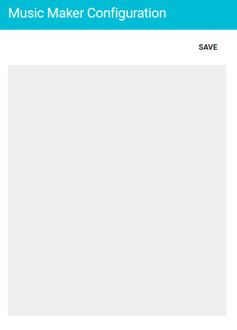
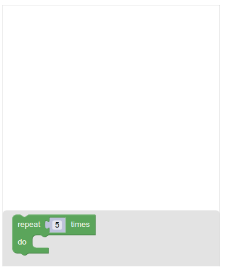
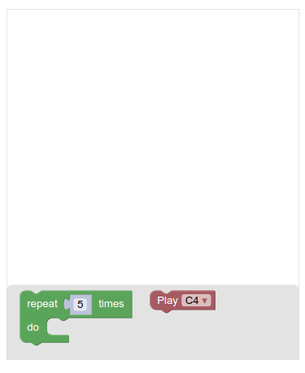

author: Rachel Fenichel, ewag
summary: In this codelab, you’ll add Blockly editor to a simple web app, to allow users to program their own music keys.
id: getting-started
categories: blockly,codelab,quickstart
status: Draft
Feedback Link: https://github.com/google/blockly-samples/issues/new

# Getting started with Blockly

## Codelab overview

### What you'll learn

This codelab will teach you how to modify a simple web app to include the [Blockly](https://developers.google.com/blockly/) visual programming library.

### What is Blockly?

Blockly is a library for building block programming apps.

Block programming allows users to create scripts and programs by using visual blocks, even if they do not know any programming language.

Blockly includes everything you need for defining and rendering blocks in a drag-n-drop editor. Each block represents a chunk of code that can be easily stacked and translated into code.

### What you'll build

MusicMaker, a web app where you can program buttons to play different sounds, using Blockly.


### What you'll need

-  A browser
-  A text editor
-  Basic knowledge of HTML, CSS and JavaScript

This codelab is focused on Blockly. The app structure, non-relevant concepts and code are glossed over and are provided for you to simply copy and paste.

## Setup

### Download the sample code

You can get the sample code for this code by either downloading the zip here:

[Download zip](https://github.com/google/blockly-samples/archive/master.zip)

or by cloning this git repo:

```bash
git clone https://github.com/google/blockly-samples.git
```

If you downloaded the source as a zip, unpacking it should give you a root folder named `blockly-samples-master`.

The relevant files are in `examples/getting-started-codelab`. There are two versions of the app:
- `starter-code/`: The starter code that you'll build upon in this codelab.
- `complete-code/`: The code after completing the codelab, in case you get lost or want to compare to your version.

Each folder contains:
- `scripts/`
  - `main.js` - The main logic for the app. In the starter project it has all the code needed to navigate and switch between views in the basic app.
  - `music_maker.js` - A small library to play sounds. We will use it to actually play sounds in the browser.
- `sounds/` - Sound files for various notes
- `styles/` - The app's CSS
- `index.html` - The app's index page.

## Explore the app

To run the app, simply open `starter-code/index.html` in a browser.

### Play Mode

By default, the app launches in "**Play Mode**". In this mode, you can see 9 buttons. None of them can do anything yet. The idea is to let the user define custom behaviors for each button, using Blockly.


### Edit mode

By tapping the **EDIT** button, you can switch to edit mode. In this mode, tapping a button will display an editor, which is where you can program how sounds should play for that button. For now, the editor screen is empty.



You can go back to the play mode by tapping **SAVE** and then **DONE** buttons.

## Add Blockly libraries

Now that you know what you'll be building, you need to add Blockly dependencies to your app.

Blockly releases are [published on npm](https://www.npmjs.com/package/blockly) on a quarterly basis. For this codelab you will import blockly using [unkpg](https://unpkg.com), which lets you import all of the files you need with a single script tag.

### Add the script tag

Open `starter-code/index.html` in a text editor and scroll to the end. You can see two script tags:

```html
<script src="scripts/music_maker.js"></script>
<script src="scripts/main.js"></script>
```

Add Blockly just before these two scripts. The order is important, because you will use Blockly objects later in `main.js`.

```html
<script src="https://unpkg.com/blockly"></script>
<script src="scripts/music_maker.js"></script>
<script src="scripts/main.js"></script>
```

### Default imports

Importing Blockly this way loads four default modules.
- Blockly core: The main Blockly library, which defines the basic Blockly UI and logic.
- Built-in block definitions: Common blocks such as loops, logic, math, and string manipulation.
- The JavaScript generator: Converts blocks into JavaScript, and contains block generators for all built-in blocks.
- English language files: String tables for all messages on built-in blocks and the Blockly UI, in English.

### Alternate imports

There are many ways to import a library in JavaScript, and this tutorial does not cover all of them. For samples that show how to integrate Blockly in your project, look at the `examples` folder in [blockly-samples](https://github.com/google/blockly-samples).

You can also define your imports more carefully to get [different generators](https://www.npmjs.com/package/blockly#blockly-generators) and [locales](https://www.npmjs.com/package/blockly#blockly-languages).

## Create a Blockly workspace

In this section you will learn how to add a workspace to your app, including how to define a toolbox.

### Parts of Blockly

A Blockly workspace has two main components:
- The area where the user assembles their blocks (the white area).
- A toolbox that contains all blocks that are available to the user (the grey area).


The toolbox may be organized into categories, and may contain both single blocks and groups of blocks. A well-organized toolbox helps the user to explore the available blocks and understand the capabilities of the underlying system.

A toolbox is defined as a JavaScript object and passed into the workspace constructor through an options struct.

For more information on this JSON format and toolbox configuration, including category creation, click <a href="https://developers.google.com/blockly/guides/configure/web/toolbox">here</a>.


### Define the toolbox

Open up `scripts/main.js` and scroll down to the end of the file. Then add the code for your toolbox definition just after the call to `enableMakerMode()`.

```js
const toolbox = {
  'kind': 'flyoutToolbox',
  'contents': [
    {
      'kind': 'block',
      'type': 'controls_repeat_ext',
      'inputs': {
        'TIMES': {
          'shadow': {
            'type': 'math_number',
            'fields': {
              'NUM': 5
            }
          }
        }
      }
    }
  ]
}
```

This JavaScript object defines a toolbox with a single "repeat loop" block.

### Injection

Adding a Blockly workspace to a page is called *injection*, because the workspace is injected into a `div` that already exists on the page.

To do this you call the function `Blockly.inject(container, options)`, which takes two arguments:
- `container` is where the Blockly workspace should be placed on the page. It can be an `Element`, an ID string, or a CSS selector.
- `options` is a dictionary of configuration options.

For this codelab we will inject into a div with the id `"blocklyDiv"`, which you can find in `index.html`:

```html
<div id="blocklyDiv" style="height: 480px; width: 400px;"></div>
```

### Create the workspace

Now add code to inject the Blockly editor just afer the code you used to define your toolbox:

```js
Blockly.inject('blocklyDiv', {
  toolbox: toolbox,
  scrollbars: false
});
```

Let's look at the options we used to initialize your blockly editor:

- `toolbox`: An JavaScript object which defines the toolbox for the editor.
- `scrollbars`: whether to show scrollbars in the workspace.

The options struct gives you significant control over your Blockly instance. You can pass options to set Blockly's theme, modify scrolling behaviour, set the renderer, and more. For more information, head over to Blockly's developer site and check out the [configuration](https://developers.google.com/blockly/guides/get-started/web#configuration) section.

### Check your work

Now refresh the page. Select the EDIT mode, then tap on one of the buttons. You should see a Blockly editor:



Drag and drop the available loop block to the workspace to test it out.

## Create a custom block

Since this is a music maker app, we want a block that plays sounds. We could create one block per sound, but instead we will create a single block with a dropdown to select which note to play:


In Blockly, a *block definition* describes how a block looks and behaves. This includes its text, colour, and shape. It may also include which other blocks it can connect to.

Blocks can be defined in either JavaScript or JSON. The developer site has a full article on [how to define a block](https://developers.google.com/blockly/guides/create-custom-blocks/define-blocks).

In this codelab we will simply provide the block definition for you to copy and use.

### Define the sound block

Create a JS file to define a new "play sound" block:

1. Add `sound_blocks.js` file in the `scripts` directory.
1. Add the following code to `sound_blocks.js`:

```js
Blockly.defineBlocksWithJsonArray([
  {
    "type": "play_sound",
    "message0": "Play %1",
    "args0": [
      {
        "type": "field_dropdown",
        "name": "VALUE",
        "options": [
          ["C4", "sounds/c4.m4a"],
          ["D4", "sounds/d4.m4a"],
          ["E4", "sounds/e4.m4a"],
          ["F4", "sounds/f4.m4a"],
          ["G4", "sounds/g4.m4a"]
        ]
      }
    ],
    "previousStatement": null,
    "nextStatement": null,
    "colour": 355
  }
]);
```

Add a script tag to `index.html` to include your new block definition:

```html
<script src="scripts/sound_blocks.js"></script>
```

Your block definitions must come after importing Blockly and before the other imports, since you will use Blockly functions in this file, and you will be using functions from this file in later files.


### Add the sound block to the toolbox

Now we can update the toolbox to include the new sound block, by adding `{'kind': 'block', 'type': 'play_sound'}`.

```js
const toolbox = {
  'kind': 'flyoutToolbox',
  'contents': [
    {
      'kind': 'block',
      'type': 'controls_repeat_ext',
      'inputs': {
        'TIMES': {
          'shadow': {
            'type': 'math_number',
            'fields': {
              'NUM': 5
            }
          }
        }
      }
    },
    {
      'kind': 'block',
      'type': 'play_sound'
    }
  ]
};
```

Run the app one more time, and play around with the new `Play (sound)` block. It should look like this:



### The block factory

This step discussed how to manually define custom blocks in Blockly. Once you've completed the entire codelab, we recommend that you check out our [block factory tool](https://developers.google.com/blockly/guides/create-custom-blocks/blockly-developer-tools), which helps automate part of this process.

## Save/load workspace

You now have a Blockly workspace that appears when editing a button. The user can use this to write code, but there's no link between the code the user has written and an individual button on the page.

Once the button behavior is defined by the user, it needs to be saved for later use. The saved code must be per button, since buttons can be programmed to play different sounds.

### Add the save method

Open `scripts/main.js`. Add the following code to the `save()` method:

```js
button.blocklySave = Blockly.serialization.workspaces.save(Blockly.getMainWorkspace());
```

`workspaces.save` takes the Blockly workspace, exports its state to a JavaScript object and stores it in a `blocklySave` property on the button. This way the exported state for the block sequence gets associated with a particular button.

### Add the load method

Similarly, when a user opens the editor, the blocks previously associated with this button should get loaded into the workspace.

In the `scripts/main.js `file, add `loadWorkspace` function:

```
function loadWorkspace(button) {
  const workspace = Blockly.getMainWorkspace();
  if (button.blocklySave) {
    Blockly.serialization.workspaces.load(button.blocklySave, workspace);
  }
}
```

This loads the blocks stored on the button that was clicked back into the workspace.

Call this function from `enableBlocklyMode`:

```
function enableBlocklyMode(e) {
  ...
  loadWorkspace(currentButton);
}
```

Now, test the code. Edit the workspace for one of the buttons, add some blocks, save it, and reopen it. The workspace should still contain the blocks you added.

## Generate JavaScript code

Now that each button can be configured with its own Blockly workspace, the next thing we want to do is to generate JavaScript code from each workspace.

This generated code will be run by the browser, effectively executing the blocks set up in the Blockly workspace.

### The language generator

Blockly can generate code from blocks for different languages, e.g. JavaScript, Python, or PHP.

A *language generator* defines the rules for generating a specific language (such as indentation). Because we are using the default imports, we don't need to add any new code to get the JavaScript generator.

As previously mentioned, you can define your imports more carefully to get a [different generator](https://www.npmjs.com/package/blockly#blockly-generators).

### Add a block generator

When Blockly generates JavaScript code for blocks in a workspace, it translates each block into code. By default, it knows how to translate all library-provided default blocks into JavaScript code. However, for any custom blocks, we need to specify our own translation functions. These are called *block generators*.

Add the following code in `scripts/sound_blocks.js`:

```js
Blockly.JavaScript['play_sound'] = function(block) {
  let value = '\'' + block.getFieldValue('VALUE') + '\'';
  return 'MusicMaker.queueSound(' + value + ');\n';
};
```

With this translation function, the following `play_sound` block:


translates into the JavaScript code "`MusicMaker.queueSound('Sounds/c4.m4a');`".

For more information on generators, read the [generating code](https://developers.google.com/blockly/guides/create-custom-blocks/generating-code) page on the developer site.

## Run generated code

Most of your work so far has been in the **Edit** mode. Now you will update the **Play** mode to actually execute the custom code associated with each block.

The function `handlePlay` is already defined in `scripts/main.js`, but it's empty. Load the workspace content associated with the pressed button:

```js
loadWorkspace(event.target);
```

Next, you need to generate the code out of that workspace, which you can do with a call to `Blockly.JavaScript.workspaceToCode`.

The user's code will consist of many `MusicMaker.queueSound` calls. At the end of our generated script, add `MusicMaker.play `call to play all the sounds added to the queue.

```js
let code = Blockly.JavaScript.workspaceToCode(Blockly.getMainWorkspace());
code += 'MusicMaker.play();';
```

Finally, execute the script with the `eval` function. Wrap it in a `try/catch` so that any runtime errors are logged to the console, instead of failing quietly:

```js
try {
  eval(code);
} catch (error) {
  console.log(error);
}
```

### The full code

The end result should look like this:

```js
function handlePlay(event) {
  loadWorkspace(event.target);
  let code = Blockly.JavaScript.workspaceToCode(Blockly.getMainWorkspace());
  code += 'MusicMaker.play();';
  try {
    eval(code);
  } catch (error) {
    console.log(error);
  }
}
```

### A note on eval
Executing scripts with eval is not always the safest option - we use it here for simplicity. If you intend to run the user's blocks in production, check out the <a href="https://github.com/NeilFraser/JS-Interpreter">JS Interpreter project</a>. This project is separate from Blockly, but was specifically written for Blockly.

### Test it

Run the app and try it out! Edit one of the buttons to play a D4 sound 3 times:


Save and exit the edit mode. Now if you tap this button, you should hear the D4 sound played 3 times.

## The End

And with that, you're done with the Blockly codelab! If you'd like to continue playing with the app, we suggest adding or changing the available blocks. There are sample sound files in the `sounds` folder - try hooking them up to a new block!

For more documentation, visit the [Blockly developer site](https://developers.google.com/blockly/).

Additionally, Blockly has an active [developer forum](https://groups.google.com/forum/#!forum/blockly). Please drop by and say hello. We're happy to answer any questions or give advice on best practices for building an app with Blockly. Feel free to show us your prototypes early; collectively we have a lot of experience and can offer hints which will save you time.
