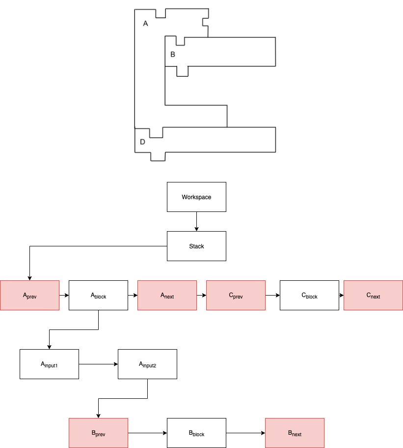
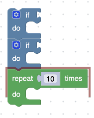

author: Abby Schmiedt
summary: Codelab to configure keyboard navigation
id: keyboard-navigation
categories: blockly,codelab,accessibility,keyboard navigation
status: Published
Feedback Link: https://github.com/google/blockly-samples/issues/new/choose

# Keyboard navigation

## Codelab overview

Keyboard navigation is the first step in making Blockly more accessible. This guide focuses on how to modify keyboard navigation.

### What you'll learn

- How to change the behavior of a cursor.
- How to change the look of cursors and markers.
- How to add a shortcut.
- How to change the current key mappings.

### What you'll build

- A cursor that displays a red blinking image over the block.
- A cursor that skips over previous and next connections.
- A keyboard shortcut for moving your cursor to the top of a stack.

### What you'll need

- Basic understanding of blocks and toolboxes in Blockly.
- NPM installed ([instructions](https://docs.npmjs.com/downloading-and-installing-node-js-and-npm)).
- Comfort using the command line/terminal.
- Familiarity with the blockly keyboard navigation [documentation](https://developers.google.com/blockly/guides/configure/web/keyboard-nav).

## Setup

In this codelab you will install the [keyboard navigation plugin](https://www.npmjs.com/package/@blockly/keyboard-navigation) on top of the Blockly sample app and then add code to create and use a custom `Cursor` and `Marker`.

### The application

You will use the (`npx @blockly/create-package app`)[https://www.npmjs.com/package/@blockly/create-package) command to create a standalone application that contains a sample setup of Blockly, including custom blocks and a display of the generated code and output.
  1. Run `npx @blockly/create-package app keyboard-navigation-codelab`.  This will create your blockly application in the folder `keyboard-navigation-codelab`.
  1. `cd` into your new directory: `cd keyboard-navigation-codelab`.
  1. Install the [keyboard navigation plugin](https://www.npmjs.com/package/@blockly/keyboard-navigation):  `npm install @blockly/keyboard-navigation --save`
  1. Run `npm start` to start the server and run the sample application.
  1. The sample app will automatically run in the browser window that opens.

## Terminology

A [**Marker**](https://developers.google.com/blockly/reference/js/blockly.marker_class) holds a location and is not movable.  A marker can be used to mark a location on the workspace that you can use later, such as marking the spot where you'll drop a block from the toolbox.

A [**Cursor**](https://developers.google.com/blockly/reference/js/blockly.cursor_class) is a marker that can move. It extends a `Blockly.Marker` but adds logic to allow the marker to move through the blocks, inputs, fields, connections and workspace coordinates.

The below image displays different parts of a block that a user can navigate to using keyboard navigation.


## Initialize NavigationController plugin

First, you will want to initialize a `NavigationController` in `index.js`.  `NavigationController` is the class in charge of registering all keyboard shortcuts.

Import `NavigationController` at the top of `index.js`:

```js
import {NavigationController} from '@blockly/keyboard-navigation';
```

Then, somewhere after the existing code that injects the workspace, instantiate an instance of `NavigationController`, initialize it, and add it to your workspace:

```js
// Initialize NavigationController plugin and add to our workspace.
const navigationController = new NavigationController();
navigationController.init();
navigationController.addWorkspace(ws);
```

At this point, your app will have default keyboard navigation enabled.  By pressing **ctrl + shift + k** you can enter into keyboard navigation mode.  From here you can use `WASD` style commands to navigate around.  To read up on these details see [the blockly keyboard navigation documentation](https://developers.google.com/blockly/guides/configure/web/keyboard-nav).

## Understand AST Nodes

When designing keyboard navigation we needed a way to organize all the different components in a workspace in a structured way. Our solution was to represent the workspace and its components as an abstract syntax tree ([AST](https://en.wikipedia.org/wiki/Abstract_syntax_tree)).

The following image displays the AST for a workspace.


There are four different levels to the AST:
1. Workspace Level (green): Holds all workspace nodes.
1. Stack Level (blue): Holds all stack nodes.
1. Block and Connection Level (red): Holds all block and connection nodes.
1. Field and Input Level (yellow): Holds all field and input nodes.

For a more detailed explanation of the different levels please see the [keyboard navigation documentation](https://developers.google.com/blockly/guides/configure/web/keyboard-nav#using_the_default_cursor).

### Create AST nodes

The `Blockly.ASTNode` class is used to represent the AST.  The `Blockly.ASTNode` class holds a workspace component. This component can be a block, connection, field, input or workspace coordinate.

The following code shows how to create a `Blockly.ASTNode` for the different workspace components:

```js
const workspaceNode = Blockly.ASTNode.createWorkspaceNode(
    workspace, wsCoordinate);
const stackNode = Blockly.ASTNode.createStackNode(topBlock);
const connectionNode = Blockly.ASTNode.createConnectionNode(connection);
const blockNode = Blockly.ASTNode.createBlockNode(block);
const fieldNode = Blockly.ASTNode.createFieldNode(field);
const inputNode = Blockly.ASTNode.createInputNode(input);
```

### Use AST nodes

We use these nodes in our cursor to decide where to go and what to draw.

Every node can:
1. Return the node below it (`in()`)
1. Return the node above it (`out()`)
1. Return the previous node (`prev()`)
1. Return the next node (`next()`)

For example, you can use the following code to get the stack node from a workspace node:

```js
const stackNode = workspaceNode.in();
```

## Define and set a custom marker

The `Blockly.blockRendering.MarkerSvg` class contains the logic to draw cursors and markers. The  `Blockly.blockRendering.MarkerSvg` class decides what to draw depending on the current node the cursor or marker holds.

Below you will create a new custom marker that will change the look of cursors and markers when they are on a block.

To start, create a new directory at `src/markers` and add a file inside named `custom_marker_svg.js`.

At the top of the file, you first need to import `blockly/core`:

```js
import * as Blockly from 'blockly/core';
```

Then define your new custom marker and have it extend `Blockly.blockRendering.MarkerSvg`:

```js
class CustomMarkerSvg extends Blockly.blockRendering.MarkerSvg {
  constructor(workspace, constants, marker) {
    super(workspace, constants, marker);
  }
}
```

Now, inside `CustomMarkerSvg`, override `createDomInternal_()`. This method is in charge of creating all dom elements for the marker. Add a new path element for when the cursor is on a block:

```js
  /**
   * @override
   */
  createDomInternal_() {
    super.createDomInternal_();

    // Create the svg element for the marker when it is on a block and set the
    // parent to markerSvg_.
    this.blockPath_ = Blockly.utils.dom.createSvgElement(
        'path', {}, this.markerSvg_);

    // If this is a cursor make the cursor blink.
    if (this.isCursor()) {
      const blinkProperties = this.getBlinkProperties_();
      Blockly.utils.dom.createSvgElement('animate', blinkProperties,
          this.blockPath_);
    }
  }
```

Next, create a method named `showWithBlock_(curNode)` that will:

- Update the block path.
- Set the current marker.
- Set the parent.
- Show the current marker.

We will call this method from within `showAtLocation_(curNode)`, when the user moves to a new block:

```js
  showWithBlock_(curNode) {
    // Get the block from the AST Node
    const block = curNode.getLocation();

    // Get the path of the block.
    const blockPath = block.pathObject.svgPath.getAttribute('d');

    // Set the path for the cursor.
    this.blockPath_.setAttribute('d', blockPath);

    // Set the current marker.
    this.currentMarkerSvg = this.blockPath_;

    // Set the parent of the cursor as the block.
    this.setParent_(block);

    // Show the current marker.
    this.showCurrent_();
  }
```

Then, override `showAtLocation_(curNode)`. This method is used to decide what to display at a given node:

```js
  /**
   * @override
   */
  showAtLocation_(curNode) {
    let handled = false;
    // If the cursor is on a block call the new method we created to draw the
    // cursor.
    if (curNode.getType() == Blockly.ASTNode.types.BLOCK) {
      this.showWithBlock_(curNode);
      handled = true;
    }

    // If we have not drawn the cursor let the parent draw it.
    if (!handled) {
      super.showAtLocation_.call(this, curNode);
    }
  }
```

Finally, override the `hide()` method:

```js
  /**
   * @override
   */
  hide() {
    super.hide();
    // Hide the marker we created.
    this.blockPath_.style.display = 'none';
  }
```

### Renderer setup

In order to have the cursor use `CustomMarkerSvg` you need to override the renderer. For more information on customizing a renderer see the custom renderer [codelab](https://blocklycodelabs.dev/codelabs/custom-renderer/index.html).

Add the following code to the bottom of `custom_marker_svg.js`, outside of the `CustomMarkerSvg` class definition:

```js
class CustomRenderer extends Blockly.thrasos.Renderer {
  constructor(name) {
    super(name);
  }
}
Blockly.blockRendering.register('custom_renderer', CustomRenderer);
```

Now you need to override the method responsible for returning the drawer for markers and cursors.

Add the following method inside the `CustomRenderer` class:

```js
makeMarkerDrawer(workspace, marker) {
  return new CustomMarkerSvg(workspace, this.getConstants(), marker);
}
```

In order to use your custom renderer, first, import it at the top of `index.js`.

```js
import './markers/custom_marker_svg';
```

Then, change your call to `Blockly.inject` to pass the newly registered renderer name `custom_renderer`:

```js
const ws = Blockly.inject(blocklyDiv, {
  toolbox: toolbox,
  renderer: 'custom_renderer',
});
```

### Test it out

Open the sample app and drag a function block on to your workspace. Press **ctrl + shift + k** to enter into keyboard navigation mode. Notice how the entire block starts flashing red.


## Define and set a custom cursor

Create a new directory at `src/cursors` and add a file inside named `custom.js`.

At the top of the new file, you first need to import `blockly/core`:

```js
import * as Blockly from 'blockly/core';
```

Then define your new custom cursor and have it extend the base cursor, `Blockly.Cursor`:

```js
export class CustomCursor extends Blockly.Cursor {
  constructor() {
    super();
  }
}
```

Import your cursor at the top of `src/index.js`.

```js
import {CustomCursor} from './cursors/custom';
```

Somewhere after the existing code that injects the workspace, use its `MarkerManager` to set your new custom cursor:

```js
// Add CustomCursor to workspace
ws.getMarkerManager().setCursor(new CustomCursor());
```

## Change the cursor behavior

### Override the move methods

In order to create a cursor that skips over previous and next connections you have to override the methods that move the cursor.

Add the following code to `cursors/custom.js`, inside the `CustomCursor` class definition. These implementations are just a starting point that you will be improving in the next step:

```js
  next() {
    // The current Blockly.ASTNode the cursor is on.
    const curNode = this.getCurNode();
    if (!curNode) {
      return null;
    }
    // The next Blockly.ASTNode.
    let newNode = curNode.next();
    if (newNode) {
      this.setCurNode(newNode);
    }
    return newNode;
  }

  in() {
    const curNode = this.getCurNode();
    if (!curNode) {
      return null;
    }
    let newNode = curNode.in();
    if (newNode) {
      this.setCurNode(newNode);
    }
    return newNode;
  }

  prev() {
    const curNode = this.getCurNode();
    if (!curNode) {
      return null;
    }
    let newNode = curNode.prev();
    if (newNode) {
      this.setCurNode(newNode);
    }
    return newNode;
  }

  out() {
    const curNode = this.getCurNode();
    if (!curNode) {
      return null;
    }
    let newNode = curNode.out();
    if (newNode) {
      this.setCurNode(newNode);
    }
    return newNode;
  }
```

### Modify the move methods

Now, you will add logic to the move methods to skip over the previous and next connections. You can reference the following image as you add logic to the move methods. The red boxes represent the nodes you want to skip.



Change the `next` method so it will skip over any previous or next connections and go straight to the next block:

```js
  next() {
    const curNode = this.getCurNode();
    if (!curNode) {
      return null;
    }
    let newNode = curNode.next();
    // While the newNode exists and is either a previous or next type go to the
    // next value.
    while (newNode && (newNode.getType() === Blockly.ASTNode.types.PREVIOUS ||
        newNode.getType() === Blockly.ASTNode.types.NEXT)) {
      newNode = newNode.next();
    }
    if (newNode) {
      this.setCurNode(newNode);
    }
    return newNode;
  }
```

Change the `prev` method so it will skip over any previous or next connections and go straight to the previous block:

```js
  prev() {
    const curNode = this.getCurNode();
    if (!curNode) {
      return null;
    }
    let newNode = curNode.prev();
    // While the newNode exists and is either a previous or next connection go
    // to the previous value.
    while (newNode && (newNode.getType() === Blockly.ASTNode.types.PREVIOUS ||
        newNode.getType() === Blockly.ASTNode.types.NEXT)) {
      newNode = newNode.prev();
    }
    if (newNode) {
      this.setCurNode(newNode);
    }
    return newNode;
  }
```

Change the `in` method so that it will skip over any previous connections and go straight to the contained block:

```js
  in() {
    const curNode = this.getCurNode();
    if (!curNode) {
      return null;
    }
    let newNode = curNode.in();
    // If the newNode is a previous connection go to the next value in the
    // level. This will be the block.
    if (newNode && newNode.getType() === Blockly.ASTNode.types.PREVIOUS) {
      newNode = newNode.next();
    }
    if (newNode) {
      this.setCurNode(newNode);
    }
    return newNode;
  }
```

#### Test it out

Open the sample app and enter into keyboard navigation mode (**ctrl + shift + k**). Drag some blocks on to the workspace and navigate to the first block. From here hit the **S** key to go to the next block. Notice how the cursor skips over the previous and next connection and goes straight to the next block.


## Adding a shortcut

In this section you will add a shortcut that will allow users to move their cursor to the top of their current stack by pressing **ctrl + W**.

### Create a key mapping

A key mapping connects a key code or combination of key codes to a shortcut. When the key code or combination of key codes are pressed the shortcut will run.

Primary keys can be combined with modifier keys by using the `createSerializedKey()` method. A list of the available modifier keys are:

- `Blockly.ShortcutRegistry.modifierKeys.SHIFT`
- `Blockly.ShortcutRegistry.modifierKeys.CONTROL`
- `Blockly.ShortcutRegistry.modifierKeys.ALT`
- `Blockly.ShortcutRegistry.modifierKeys.META`

Create a key code for **ctrl + W** by adding the following code to the bottom of `index.js`:

```js
// Create a serialized key from the primary key and any modifiers.
const ctrlW = Blockly.ShortcutRegistry.registry.createSerializedKey(
    Blockly.utils.KeyCodes.W, [Blockly.ShortcutRegistry.modifierKeys.Control]);
```

### Create a shortcut

Now, you will create your shortcut.

A shortcut has several properties:
- `name`: The name of the shortcut. This must be unique.
- `keyCodes`: A list of key codes that when pressed will trigger this shortcut. This shortcut will use the `ctrlW` defined above.
- `preconditionFn`: A function that returns true if and only if the shortcut should be run.  This shortcut will only run when `workspace.keyboardAccessibilityMode` is true.
- `callback`: A function that is called when the shortcut has been executed. This should return true if the shortcut has been handled. If a shortcut returns true, no other shortcuts with the same key mapping will be handled.

Add the following code to the bottom of `index.js`:

```js
const moveToStack = {
  name: 'moveToStack',
  keyCodes: [ctrlW], // The custom key mapping.
  preconditionFn: function(workspace) {
    return workspace.keyboardAccessibilityMode;
  },
  callback: function(workspace) {
    const cursor = workspace.getCursor();
    // Gets the current node.
    const currentNode = cursor.getCurNode();
    // Gets the source block from the current node.
    const currentBlock = currentNode.getSourceBlock();
    // If we are on a workspace node there will be no source block.
    if (currentBlock) {
      // Gets the top block in the stack.
      const rootBlock = currentBlock.getRootBlock();
      // Gets the top node on a block. This is either the previous connection,
      // output connection, or the block itself.
      const topNode = Blockly.ASTNode.createTopNode(rootBlock);
      // Update the location of the cursor.
      cursor.setCurNode(topNode);
      return true;
    }
  },
};

```
Once you have created the shortcut, you can register it by adding the following code to the bottom `index.js`:

```js
Blockly.ShortcutRegistry.registry.register(moveToStack);
```

### Test it out

Open the sample app and create a stack of blocks. Enter keyboard navigation
mode by pressing **shift + control + K**. Move your cursor down a few
blocks and then press **ctrl + W**. Notice how the cursor jumps to the top of
the stack of blocks.



## Change current key mappings

In this section, you will update key mappings so you can use the arrow
keys for your cursor instead of the default **WASD** keys.

Before adding the key mappings below, import the shortcut names by adding the
following line to the top of `index.js`:

```js
import {Constants} from '@blockly/keyboard-navigation';
```

Now set the keys for the next, previous, in and out actions at the bottom of `index.js`:

```js
Blockly.ShortcutRegistry.registry.removeAllKeyMappings(Constants.SHORTCUT_NAMES.OUT);
Blockly.ShortcutRegistry.registry.addKeyMapping(Blockly.utils.KeyCodes.LEFT, Constants.SHORTCUT_NAMES.OUT);

Blockly.ShortcutRegistry.registry.removeAllKeyMappings(Constants.SHORTCUT_NAMES.IN);
Blockly.ShortcutRegistry.registry.addKeyMapping(Blockly.utils.KeyCodes.RIGHT, Constants.SHORTCUT_NAMES.IN);

Blockly.ShortcutRegistry.registry.removeAllKeyMappings(Constants.SHORTCUT_NAMES.PREVIOUS);
Blockly.ShortcutRegistry.registry.addKeyMapping(Blockly.utils.KeyCodes.UP, Constants.SHORTCUT_NAMES.PREVIOUS);

Blockly.ShortcutRegistry.registry.removeAllKeyMappings(Constants.SHORTCUT_NAMES.NEXT);
Blockly.ShortcutRegistry.registry.addKeyMapping(Blockly.utils.KeyCodes.DOWN, Constants.SHORTCUT_NAMES.NEXT);
```

Note: For a full list of the shortcuts registered in the keyboard navigation plugin see the [constants file](https://github.com/google/blockly-samples/blob/master/plugins/keyboard-navigation/src/constants.js).

### Test it out

Open the sample app and enter keyboard navigation mode (**ctrl + shift + k**). You can now use the arrow keys to move around instead of the default **WASD** keys.

## Summary

There is still a lot of work to be done in figuring out the best way to provide
keyboard navigation support for users. Hopefully, everything you learned in this
codelab will help you test out any ideas you have.

In this codelab you learned:
- How to create a new cursor.
- How to change the look of markers and cursors.
- How to add shortcuts.
